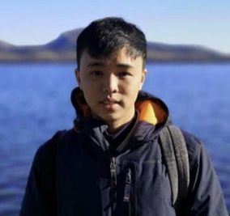
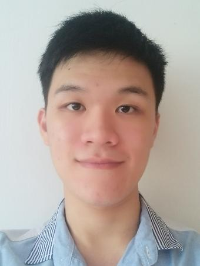
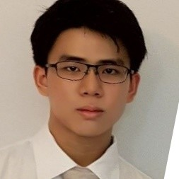

We are a team based in the [School of Computing, National University of Singapore](http://www.comp.nus.edu.sg).

You can reach us at the email `seer[at]comp.nus.edu.sg`

## Project team

### Sean Ng

[[github](http://github.com/snss231)]] [[portfolio](team/snss231.md)]

* Role: Developer
* Responsibilities: Data

### Ong Jun Jie

[[github](http://github.com/junjunjieong)]] [[portfolio](team/junjunjieong.md)]

* Role: Developer
* Responsibilities: Code quality + Deliverables and deadlines

### Tan Jun Rong

[[github](http://github.com/junrong98)]] [[portfolio](team/junrong98.md)]

* Role: Developer
* Responsibilities: Code Quality, In Charge of Tagging

### Adrian Ong

[[github](http://github.com/AdrianOngJJ)]] [[portfolio](team/AdrianOngJJ.md)]

* Role: Developer
* Responsibilities: Glossary
