## Table of Contents
* [Acknowledgements](#acknowledgements)
* [Setting up, getting started](#setting-up-getting-started)
* [Design](#design)
    * [Architecture](#architecture)
    * [Ui component](#ui-component)
    * [Logic component](#logic-component)
    * [Model component](#model-component)
    * [Storage component](#storage-component)
    * [Common classes](#common-classes)
* [Implementation](#implementation)
    * [Delete person feature](#delete-person-feature)
    * [Delete task feature](#delete-task-feature)
    * [Edit task feature](#edit-task-feature)
    * [View task feature](#view-task-feature)
* [Documentation, logging, testing, configuration, dev-ops](#documentation-logging-testing-configuration-dev-ops)
* [Appendix: Requirements](#appendix-requirements)
    * [Product scope](#product-scope)
    * [User stories](#user-stories)
    * [Use cases](#use-cases)
    * [Non-Functional requirements](#non-functional-requirements)
* [Appendix: Instructions for manual testing](#appendix-instructions-for-manual-testing)
    * [Launch and shutdown](#launch-and-shutdown)
    * [Deleting a person](#deleting-a-person)
    * [Saving data](#saving-data)
* [Glossary](#glossary)

--------------------------------------------------------------------------------------------------------------------

## **Acknowledgements**

* [PlantUML](https://plantuml.com/) - open-source diagramming tool used for our architecture, class, sequence and activity diagrams.
* [JUnit](https://junit.org/junit5/) - Java testing framework used for most of our testing 
* [Gradle](https://gradle.org/) - Build automation tool 
* [Shadowjar](https://plugins.gradle.org/plugin/com.github.johnrengelman.shadow) - "A Gradle plugin for collapsing all dependencies and project code into a single Jar file."
* [Jackson](https://github.com/FasterXML/jackson) - "JSON for Java" library

--------------------------------------------------------------------------------------------------------------------

## **Setting up, getting started**

Refer to the guide [_Setting up and getting started_](SettingUp.md).

--------------------------------------------------------------------------------------------------------------------

## **Description**
NUS Classes is a desktop app for NUS Computing professors to manage their tasks and contacts. It includes task management features such as creating tasks, tagging tasks, assigning contacts to tasks, and marking tasks as complete or incomplete. It also includes contact management features such as finding contacts, assigning contacts to specific tasks and tagging contacts.

NUS Classes also provides a simple alert feature for tasks by displaying tasks in different color based on the urgency of the task. Tasks that are overdue are marked as red, whereas, tasks that are nearing deadline are marked as yellow.

NUS Classes is optimized for use via a Command Line Interface (CLI) while still having the benefits of a Graphical User Interface (GUI). Using NUS Classes can get your contact management tasks done faster than traditional GUI apps, saving time on otherwise tedious administrative tasks.

This Developer Guide is documented with the approach of developer-as-maintainer, explaining how the architecture and implementation of NUS Classes is done
to allow for easy maintenance and modification if necessary. In this Developer Guide, you will find explanations as well as diagrams for the main components of NUS Classes at the high-level design as well as in-depth explanations
on certain key features.

## **Design**

:bulb: **Tip:** The `.puml` files used to create diagrams in this document can be found in the [diagrams](diagrams/) folder. Refer to the [_PlantUML Tutorial_ at se-edu/guides](https://se-education.org/guides/tutorials/plantUml.html) to learn how to create and edit diagrams.

### Architecture

The ***Architecture Diagram*** given above explains the high-level design of the App.

Given below is a quick overview of main components and how they interact with each other.

**Main components of the architecture**

**`Main`** has two classes called [`Main`](https://github.com/se-edu/addressbook-level3/tree/master/src/main/java/seedu/address/Main.java) and [`MainApp`](https://github.com/se-edu/addressbook-level3/tree/master/src/main/java/seedu/address/MainApp.java). It is responsible for,
* At app launch: Initializes the components in the correct sequence, and connects them up with each other.
* At shut down: Shuts down the components and invokes cleanup methods where necessary.

[**`Commons`**](#common-classes) represents a collection of classes used by multiple other components.

The rest of the App consists of four components.

* [**`UI`**](#ui-component): The UI of the App.
* [**`Logic`**](#logic-component): The command executor.
* [**`Model`**](#model-component): Holds the data of the App in memory.
* [**`Storage`**](#storage-component): Reads data from, and writes data to, the hard disk.

**How the architecture components interact with each other**

The *Sequence Diagram* below shows how the components interact with each other for the scenario where the user issues the command `delete 1`.

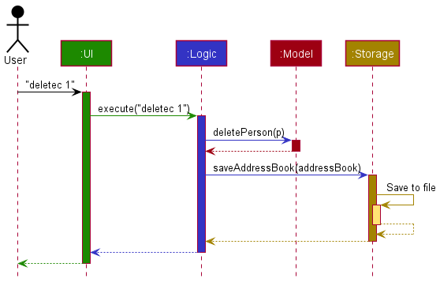

Each of the four main components (also shown in the diagram above),

* defines its *API* in an `interface` with the same name as the Component.
* implements its functionality using a concrete `{Component Name}Manager` class (which follows the corresponding API `interface` mentioned in the previous point.

For example, the `Logic` component defines its API in the `Logic.java` interface and implements its functionality using the `LogicManager.java` class which follows the `Logic` interface. Other components interact with a given component through its interface rather than the concrete class (reason: to prevent outside component's being coupled to the implementation of a component), as illustrated in the (partial) class diagram below.

The sections below give more details of each component.

### UI component

The **API** of this component is specified in [`Ui.java`](https://github.com/se-edu/addressbook-level3/tree/master/src/main/java/seedu/address/ui/Ui.java)

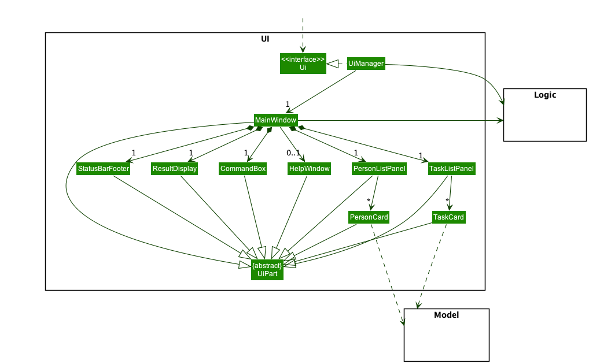

The UI consists of a `MainWindow` that is made up of parts e.g.`CommandBox`, `ResultDisplay`, `PersonListPanel`, `StatusBarFooter` etc. All these, including the `MainWindow`, inherit from the abstract `UiPart` class which captures the commonalities between classes that represent parts of the visible GUI.

The `UI` component uses the JavaFx UI framework. The layout of these UI parts are defined in matching `.fxml` files that are in the `src/main/resources/view` folder. For example, the layout of the [`MainWindow`](https://github.com/se-edu/addressbook-level3/tree/master/src/main/java/seedu/address/ui/MainWindow.java) is specified in [`MainWindow.fxml`](https://github.com/se-edu/addressbook-level3/tree/master/src/main/resources/view/MainWindow.fxml)

The `UI` component,

* executes user commands using the `Logic` component.
* listens for changes to `Model` data so that the UI can be updated with the modified data.
* keeps a reference to the `Logic` component, because the `UI` relies on the `Logic` to execute commands.
* depends on some classes in the `Model` component, as it displays `Person` object residing in the `Model`.

### Logic component

**API** : [`Logic.java`](https://github.com/se-edu/addressbook-level3/tree/master/src/main/java/seedu/address/logic/Logic.java)

Here's a (partial) class diagram of the `Logic` component:

How the `Logic` component works:
1. When `Logic` is called upon to execute a command, it uses the `AddressBookParser` class to parse the user command.
1. This results in a `Command` object (more precisely, an object of one of its subclasses e.g., `AddCommand`) which is executed by the `LogicManager`.
1. The command can communicate with the `Model` when it is executed (e.g. to add a person).
1. The result of the command execution is encapsulated as a `CommandResult` object which is returned back from `Logic`.

The Sequence Diagram below illustrates the interactions within the `Logic` component for the `execute("delete 1")` API call.

:information_source: **Note:** The lifeline for `DeleteCommandParser` should end at the destroy marker (X) but due to a limitation of PlantUML, the lifeline reaches the end of diagram.

Here are the other classes in `Logic` (omitted from the class diagram above) that are used for parsing a user command:

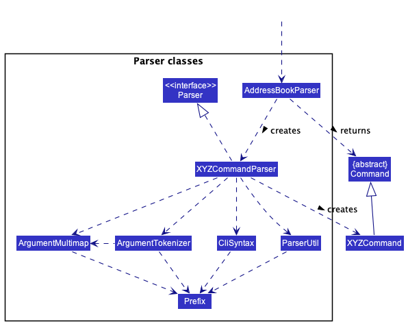

How the parsing works:
* When called upon to parse a user command, the `AddressBookParser` class creates an `XYZCommandParser` (`XYZ` is a placeholder for the specific command name e.g., `AddCommandParser`) which uses the other classes shown above to parse the user command and create a `XYZCommand` object (e.g., `AddCommand`) which the `AddressBookParser` returns back as a `Command` object.
* All `XYZCommandParser` classes (e.g., `AddCommandParser`, `DeleteCommandParser`, ...) inherit from the `Parser` interface so that they can be treated similarly where possible e.g, during testing.

### Model component
**API** : [`Model.java`](https://github.com/se-edu/addressbook-level3/tree/master/src/main/java/seedu/address/model/Model.java)

The `Model` component,

* stores the address book data i.e., all `Person` objects (which are contained in a `UniquePersonList` object).
* stores the task list data i.e., all 'Task' objects (which are contained in a `TaskList` object).
* stores the currently 'selected' `Person` objects (e.g., results of a search query) as a separate _filtered_ list which is exposed to outsiders as an unmodifiable `ObservableList<Person>` that can be 'observed' e.g. the UI can be bound to this list so that the UI automatically updates when some `Person`'s data in the list changes.
* stores the currently 'selected' `Task` objects (e.g. results of a search query) as a separate _filtered_ list which is exposed to outsiders as an unmodifiable `ObservableList<Task>` that can be 'observed' e.g. the UI can be bound to this list so that the UI automatically updates when some `Task`'s data in the list changes.
* stores a `UserPref` object that represents the user’s preferences. This is exposed to the outside as a `ReadOnlyUserPref` objects.
* does not depend on any of the other three components (as the `Model` represents data entities of the domain, they should make sense on their own without depending on other components)

### Storage component

**API** : [`Storage.java`](https://github.com/se-edu/addressbook-level3/tree/master/src/main/java/seedu/address/storage/Storage.java)

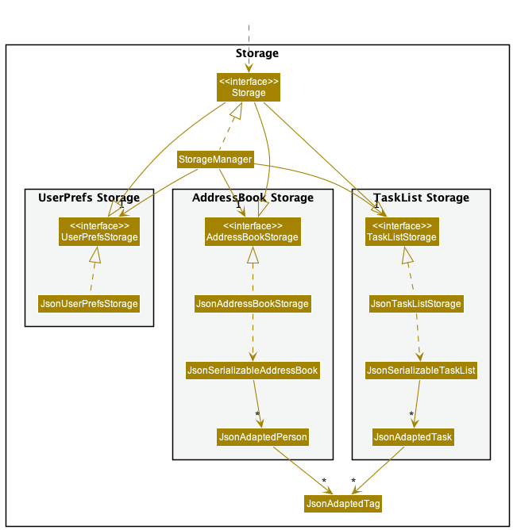

The `Storage` component,
* can save address book, task list and user preference data in json format, and read them back into corresponding objects.
* inherits from `AddressBookStorage`, `TaskListStorage` and `UserPrefStorage`, which means it can be treated as any one of them (if only the functionality of one is needed).
* depends on some classes in the `Model` component (because the `Storage` component's job is to save/retrieve objects that belong to the `Model`)

### Common classes

Classes used by multiple components are in the `seedu.addressbook.commons` package.

--------------------------------------------------------------------------------------------------------------------

## **Implementation**

This section describes some noteworthy details on how certain features are implemented.

### Delete person feature

In NUS Classes, `Task`s are entities that maintain a list of `People` that are associated with the task.
When a contact is deleted from the `AddressBook`, it is essential that the `Task`s that contain that contact are updated to also remove the contact.
To implement this, upon every `DeleteCommand` execution, we call the `TaskList::removePerson` which iterate through all the tasks and remove the relevant `Person` from the tasks if present.

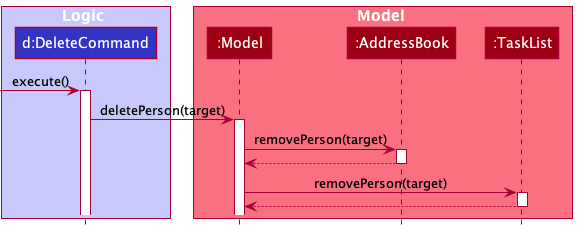

Design considerations:

**Aspect:** how relevant tasks are updated when a person is removed from the address book

* **Alternative 1 (current choice):** Iterate through all tasks to remove the relevant person.
  * Pros: Easy to implement.
  * Cons: _May_ have performance issues given a large list of tasks

* **Alternative 2:** Add a reference from each Person to the Tasks they are associated with. When a person is deleted, reference all the tasks through the `Person` object to update the tasks.
  * Pros: _May_ see some performance benefit (not necessary to iterate through all the tasks upon each `DeleteCommand`)
  * Cons: More fragile code due to circular dependency (`Person` depends on `Task`). Not often that a Professor will delete a contact (student or tutor) in the course of a module.

### Delete Task feature
Delete task feature implements the following operations:
* `DeleteTaskCommandParser#parse()` — Parse the index number from user command to `DeleteTaskCommand` to get the task to be deleted.
* `DeleteTaskCommand#execute()` — Execute `ModelManager#deleteTask()` by parsing in the task to be deleted.
* `ModelManager#deleteTask()` — Execute `TaskList#deleteCurrTask()` by parsing in the task to be deleted.
* `TaskList#deleteCurrTask()` — Deletes the task from the TaskList stored here.

Step 1: User will enter the command `deletet 1` to delete the first task.
Once user parse in the command, it will be handled by `AddressBookParser#parseCommand()`, then calling of `DeleteTaskCommandParser#parse()`
to create `DeleteTaskCommand` and execute to delete the task from the task list.

The Sequence Diagram below illustrates the interactions of how the delete task feature work.
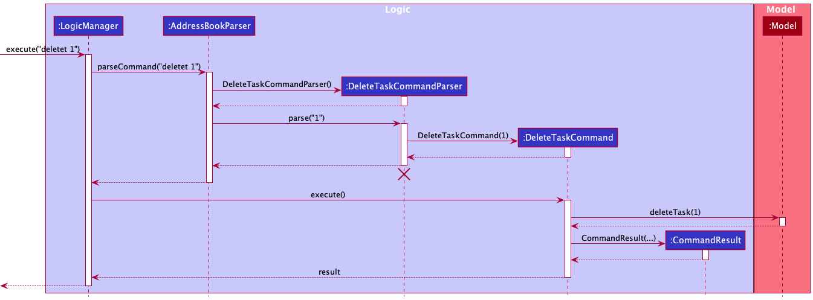

:information_source: **Note:** The lifeline for `DeleteTaskCommandParser` should end at the destroy marker (X) but due to a limitation of PlantUML, the lifeline reaches the end of diagram.

Step 2: Outcome after executing `DeleteTaskCommand`

Execution flow of Activity Diagram:

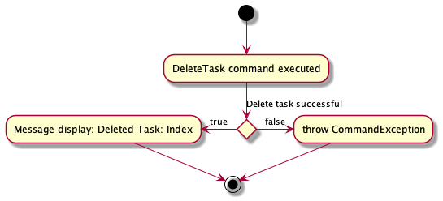

#### Design considerations:
**Aspect: How delete task executes:**

* **Alternative 1 (current choice):** Delete task based on the index shown.
    * Pros: Easy to implement.
    * Cons: Have to scroll through task list to look for task index number.

* **Alternative 2:** Delete task based on the task name.
    * Pros: User just have to enter the task name.
    * Cons: We must do check ensure that user enter the correct spelling and spacing of the task name

### Edit Task feature
Edit task feature implements the following operations:
* `EditTaskCommandParser#parse()` — Parse the command such as index of the task to edit and which information to update.
* `EditTaskCommand#execute()` — Execute `ModelManager#setTask()` by parsing in the task to be edited and the updated version of the task.
* `EditTaskDescriptor#setName()` — Set the edited task name to `EditTaskDescriptor`
* `EditTaskDescriptor#setDate()` — Set the edited datetime to `EditTaskDescriptor`
* `EditTaskDescriptor#setTags()` — Set the edited tags to `EditTaskDescriptor`
* `ParseUtil#parseIndex()` —  Parse to get the index number of the task
* `ModelManager#setTask()` — Update the task information.
* `ModelManager#updateFilteredTaskList()` — Updates the filter of the filtered task list to filter by the given predicate.

Step 1: User parse in command. For example, `editt 1 tn/Teach CS2103T dt/12-03-2022 1330 z/https://zoomlink.com t/Homework`
Once user parse in the command, it will be handled by `AddressBookParser#parseCommand()`, then calling of `EditTaskCommandParser#parse()`
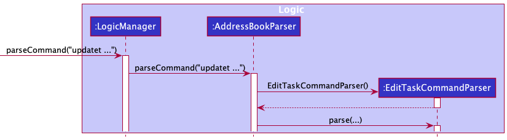

Step 2: `EditTaskCommandParser` will call `ParseUtil#parseIndex()` to get the task index.
Then `EditTaskCommandParser` will create `EditTaskDescriptor editTaskDescriptor`. `EditTaskCommandParser` will check if the
task name, datetime, link or tag prefix exist. It is optional to not have all the prefixes as user may not want to change certain field.
For each prefix in the command, it will set the value to `editTaskDescriptor`.
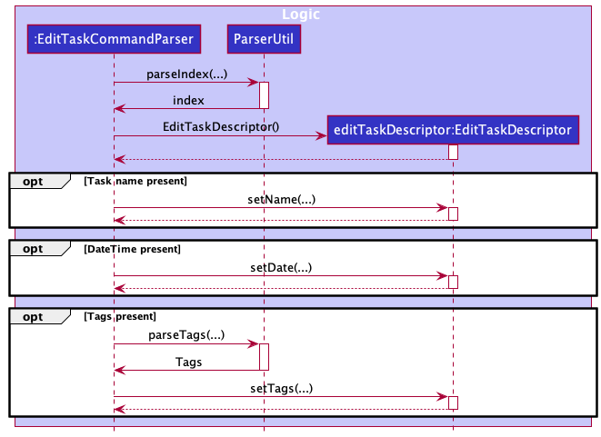

Step 3: `EditTaskCommandParser` will create `EditTaskCommand`, parse in `index` and `editTaskDescriptor`
`EditTaskCommand` will start to execute and call `ModelManager#setTask` and `ModelManager#updateFilteredTaskList` to update
the task and task list.
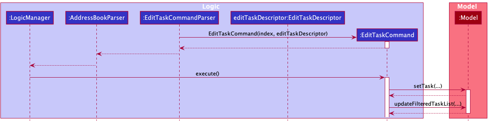

Step 4: Lastly return the result.
Possible outcome from the result.
* Outcome 1: Successfully updated task.
* Outcome 2: Throw CommandException due to index out of range or task is repeated.

* 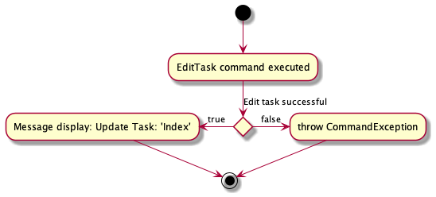

The Sequence Diagram below illustrates the overall interactions of how the edit task feature work.
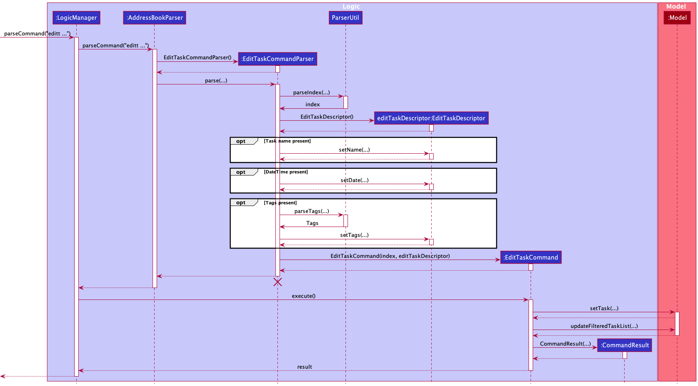

### View Task feature
The view task mechanism is facilitated by `ViewCommand`, `ViewCommandParser`, `ModelManager` and `Task`. Additionally, it implements the following operation:

* `ViewCommandParser#parse()` — Parses the arguments provided by the users into a command to be executed.
* `ViewCommand#execute()`  — Executes the operations required to display the people associated with a specific task.
* `ModelManager#getFilteredTaskList()`  — Gets the task list currently displayed as output to the user.
* `ModelManager#updateFilteredPersonList()`  — Updates the person list displayed as output to the user by providing the argument with a list of people.
* `Task#getPeople()` — Gets a list of people associated to a task.

Given below is an example usage scenario and how the view task mechanism behaves at each step.

Step 1. The user will enter the command `view 1` to view the people associated with the first task. The command will be handled by
`AddressBookParser#parseCommand()` which will create a `ViewCommandParser` object.

Step 2. The `AddressBookParser` will call `ViewCommandParser#parse()` which will parse the command, returning a `ViewCommand` to be executed.

Step 3. The `LogicManager` will call `ViewCommand#execute()` which will execute the command. It will retrieve the task list
by calling `ModelManager#getFilteredTaskList()` and retrieve the first `Task` from this list.

Step 4. Afterwards, the `ViewCommand` will call `Task#getPeople()` to obtain the list of people associated with the `Task` and pass this list as an argument to
`ModelManager#updateFilteredPersonList()` which will proceed to update the UI.

The following sequence diagram shows how the view task operation works:
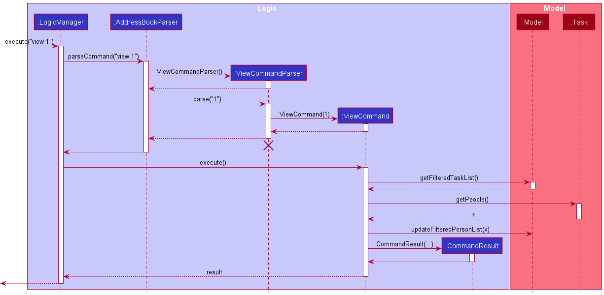

:information_source: **Note:** The lifeline for `EditTaskCommandParser` should end at the destroy marker (X) but due to a limitation of PlantUML, the lifeline reaches the end of diagram.

#### Design considerations:

**Aspect:** How should the results be displayed in the *Contact* column when no one is associated with the task:

* **Alternative 1 (current choice):** Continue displaying the current list of people.
  * Pros: Reduce commands required by user to populate and use the column for input.
  * Cons: May be confusing to user.

* **Alternative 2:** Display an empty list.
  * Pros: Clearly inform the users that the task has no people associate with it.
  * Cons: Requires more commands by the user in order to use the column again.
  

--------------------------------------------------------------------------------------------------------------------

## **Documentation, logging, testing, configuration, dev-ops**

* [Documentation guide](Documentation.md)
* [Testing guide](Testing.md)
* [Logging guide](Logging.md)
* [Configuration guide](Configuration.md)
* [DevOps guide](DevOps.md)

--------------------------------------------------------------------------------------------------------------------

## **Appendix: Requirements**

### Product scope

**Target user profile**:

* NUS professors
* has a need to manage a significant number of contacts
* has a need to organise these contacts (e.g. by role - Teaching Assistant, Student - or by class groups)
* has a need to keep track of who's involved in each task
* prefer desktop apps over other types
* prefers typing to mouse interactions
* is reasonably comfortable using CLI apps

**Value proposition**: Professors can organise their module-related tasks and contacts in one place, boosting their efficiency and productivity.

### User stories

Priorities: High (must have) - `* * *`, Medium (nice to have) - `* *`, Low (unlikely to have) - `*`

| Priority | As a …​             | I want to …​                                           | So that I can…​                                                           |
|----------|---------------------|--------------------------------------------------------|---------------------------------------------------------------------------|
| `* * *`  | new user            | see usage instructions                                 | refer to instructions when I forget how to use the App                    |
| `* * *`  | user                | add a new person                                       | manage my contacts more efficiently                                       |
| `* * *`  | user                | add a new task                                         | manage my schedule more efficiently                                       |
| `* * *`  | user                | delete a person                                        | remove entries that I no longer need                                      |
| `* * *`  | user                | delete a task                                          | remove the task I no longer need                                          |
| `* * *`  | user                | find a person by name                                  | locate details of persons without having to go through the entire list    |
| `* * *`  | user                | assign people to tasks                                 | easily keep track of the people involved in a task                        |
| `* * *`  | user                | unassign people from tasks                             | easily maintain the list of people involved in a task                     |
| `* * *`  | user                | find a person by name                                  | locate details of persons without having to go through the entire list    |
| `* * *`  | user                | tag my contacts                                        | organize the contacts to look neater                                      |
| `* * *`  | user                | filter my tasks by name or date                        | locate tasks without having to go through the entire list                 |
| `* * *`  | user                | view contact details                                   | lookup important contact information                                      |
| `* * *`  | user                | tag tasks                                              | organise my tasks                                                         |
| `* * *`  | user                | assign and remove the task to/from my contacts         | allocate my tasks to the specific contact as needed                       |
| `* * *`  | user                | view the contacts assigned to a task                   | lookup the information of the people assigned to a task                   |
| `* *`    | lecturer            | store the meeting links of my tasks                    | easily access the meetings when I need to                                 |
| `* *`    | user                | import contact data from a csv file                    | easily initialize my contacts without having to type hundreds of commands |
| `* *`    | user                | generate emails of all the contacts assigned to a task | easily transfer the emails to my preferred email client to contact them   | 
| `* *`    | computing professor | get a contact's Github username                        | lookup their Github profiles                                              |
| `* *`    | professor           | group the students based on module                     | know which student is under which module                                  |
| `*`      | professor           | add graded component of the module                     | track students' performance of the module                                 |

### Use cases

(For all use cases below, the **System** is `NUS Classes` and the **Actor** is the `user`, unless specified otherwise)

### Use case: UC01 - Delete a person

**MSS**

1. User requests to list persons
2. NUS Classes shows a list of persons
3. User requests to delete a specific person in the list
4. NUS Classes deletes the person

    Use case ends.

**Extensions**

* 2a. The list is empty.
  * Use case ends.

* 3a. The given index is invalid.

    * 3a1. NUS Classes shows an error message. 
    * Use case resumes from step 3.
    

### Use case: UC02 - Import contacts

**MSS**
1. User requests to import contacts, providing the filepath of the source data file.
2. NUS Classes adds the contacts to the contact list.

**Extensions**

* 1a. NUS Classes can't find the file
    * 1a1. NUS Classes shows an error message.
    * Use case ends.
* 1b. NUS Classes detects that the file is of invalid format or is a directory
    * 1b1. NUS Classes shows an error message.
    * Use case ends.
* 1c. NUS Classes detects that some entries have invalid fields
    * 1c1. NUS Classes informs the user of the invalid fields and the reason they are invalid
    * 1c2. User fixes these fields
    * Use case continues from step 1.

### Use case: UC03 - See all scheduled tasks

**MSS**
1. User requests to see all tasks
2. NUS Classes shows a list of scheduled tasks

  
### Use case: UC04 - Schedule a task with a group

**MSS**

1. User requests to create a task
2. NUS Classes creates the task
3. User requests to assign contacts to the task
4. NUS Classes assigns the contacts to the task

    Use case ends.

**Extensions**

* 1a. Compulsory arguments are omitted (e.g. name or date-time)
    * 1a1. NUS Classes shows an error message.
      Use case ends.

* 2a. Invalid group type/index is provided
  * 2a1. NUS Classes shows an error message.
  * Use case ends.
  
    
### Use case: UC05 - Update a task

**MSS**

1. User requests to see all tasks (UC03)
2. User requests to update a task, providing the details of the fields to be edited and the index of the task
3. NUS Classes updates the task

Use case ends

**Extensions**

* 2a. The index is out of bounds/invalid
  * 2a1. NUS Classes shows an error message. 
  * Use case ends.
* 2b. The fields provided are invalid 
  * 2b1. NUS Classes shows an error message.
  * Use case ends.
* 2c. No optional arguments are provided
  * 2c1. NUS Classes shows an error message.
  * Use case ends.

### Use case: UC06 - Generate emails of all contacts assigned to a task

**MSS**

1. User requests to see all tasks (UC03)
2. User requests to generate the emails of all contacts a task, and provides the index of the task
3. NUS Classes displays the emails and provides a button to copy the emails.

Use case ends.

**Extensions**

* 1a. NUS Classes doesn't have any tasks created
  * 1a1. NUS Classes shows an error message.
  * Use case ends.
* 2a. NUS Classes detects that the index provided is invalid
  * 2a1. NUS Classes shows an error message.
  * Use case ends.
* 3a. User clicks the button to copy the emails.
  * 3a1. User pastes the emails into their preferred email application
  * Use case ends.

### Use case: UC07 - Searching for tasks by name and/or tags

**MSS**

1. User specifies the keyword to search for.
2. NUS Classes displays the tasks whose names and/or tags match the keyword.
Use case ends.

### Use case: UC08 - Searching for tasks by date range

**MSS**

1. User specifies the date range to search for.
2. NUS Classes displays the tasks whose date(s) fit within the range.
   Use case ends.

### Non-Functional Requirements

1. Should work on any _mainstream OS_ as long as it has Java `11` or above installed.
2. Should be able to hold up to 1000 persons and/or without a noticeable sluggishness in performance for typical usage.
3. A user with above average typing speed for regular English text (i.e. not code, not system admin commands) should be able to accomplish most of the tasks faster using commands than using the mouse.
4. App should not exit or shut down without user explicit command.
5. App should display relevant information within 2 seconds after user enter command.
6. The information stored should not change without user explicit command.
7. Should be able to download and use without installer.
8. Should be able to work and store information without any third party database system.

## **Appendix: Instructions for manual testing**

Given below are instructions to test the app manually.

:information_source: **Note:** These instructions only provide a starting point for testers to work on;
testers are expected to do more *exploratory* testing.

### Launch and shutdown

1. Initial launch

   1. Download the jar file and copy into an empty folder

   2. Double-click the jar file Expected: Shows the GUI with a set of sample contacts and tasks.
   
2. Shutdown
   1. Click the 'close' button or execute the `exit` command Expected: The app shuts down
   

### Deleting a person

1. Deleting a person while all persons are being shown

   1. Prerequisites: List all persons using the `list` command. Multiple persons in the list.

   1. Test case: `delete 1` 
      Expected: First contact is deleted from the list. Details of the deleted contact shown in the status message.

   1. Test case: `delete 0` 
      Expected: No person is deleted. Error details shown in the status message. Status bar remains the same.

   1. Other incorrect delete commands to try: `delete`, `delete x`, `...` (where x is larger than the list size) 
      Expected: Similar to previous.
   

### Saving data

1. Data (contacts and tasks) should be automatically saved when the app is shut down.
   1. Test case: `addc n/Test Person p/123456 e/e1234@u.nus.edu u/test123`, then `exit` and restart the app.  Expected: The created contact is saved and is shown.
   2. Test case: `addt tn/Test task dt/12-12-2020 1234`, then `exit` and restart the app.  Expected: The created task is saved and is shown.
   
### Importing contacts from a .csv file
1. The import feature should work with a valid .csv file.
   1. Test case:
      1. Create a .csv file with the filename `test.csv` using a text editor and place it into the NUS Classes folder.
      2. The .csv file should contain the headers `Name,Phone,Github,Email,Tags`
      3. On the next line, add the sample contact `Alex Bean,91234567,alexbean@gmail.com,Lab 12F/Student`
      4. Execute the command `import fp/test.csv`
      5. The NUS Classes should inform you that the contact has been successfully imported, and the contact is displayed in the contact list.
   2. For advanced testing, you may rename the file and place it in a subdirectory.
      * make sure to specify the filepath relative to the jar directory, specified according your OS's file system.

## **Glossary**

| Term          | Meaning                                                                                                                                                                                    |
|---------------|--------------------------------------------------------------------------------------------------------------------------------------------------------------------------------------------|
| API           | Application Programming Interface. Enables different systems to interact with each other programmatically                                                                                  |
| .csv          | A plain text file containing a list of data, separated by commas                                                                                                                           |
| NUS           | National University of Singapore                                                                                                                                                           | 
| NUS Classes   | The name of the application                                                                                                                                                                |
| Mainstream OS | Windows, Linux, MacOS                                                                                                                                                                      |
| UI            | User Interface, the means by which the user interacts with the system                                                                                                                      |
| CLI           | Command-line interface, which processes text-based commands from the user                                                                                                                  |
| GUI           | Graphical user interface, a visual way of interacting with a computer using items such as windows, icons and menus                                                                         |
| Jar           | A JAR (Java ARchive) is a package file format typically used to aggregate many Java class files and associated metadata and resources (text, images, etc.) into one file for distribution. |
