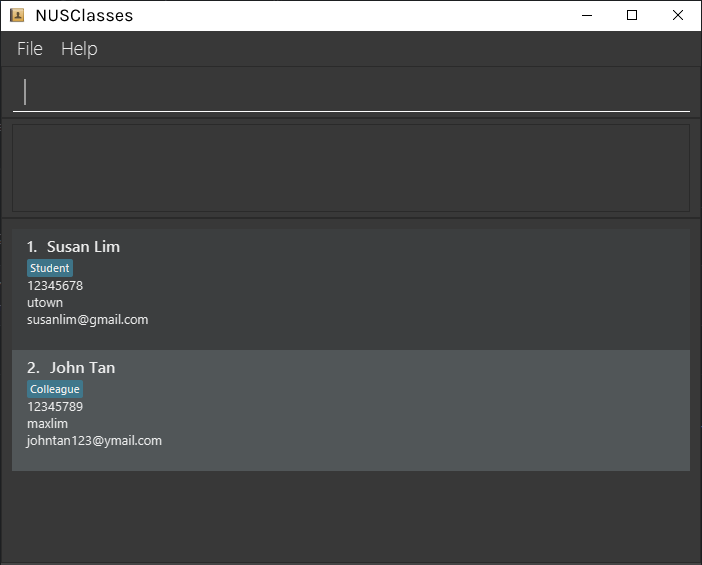
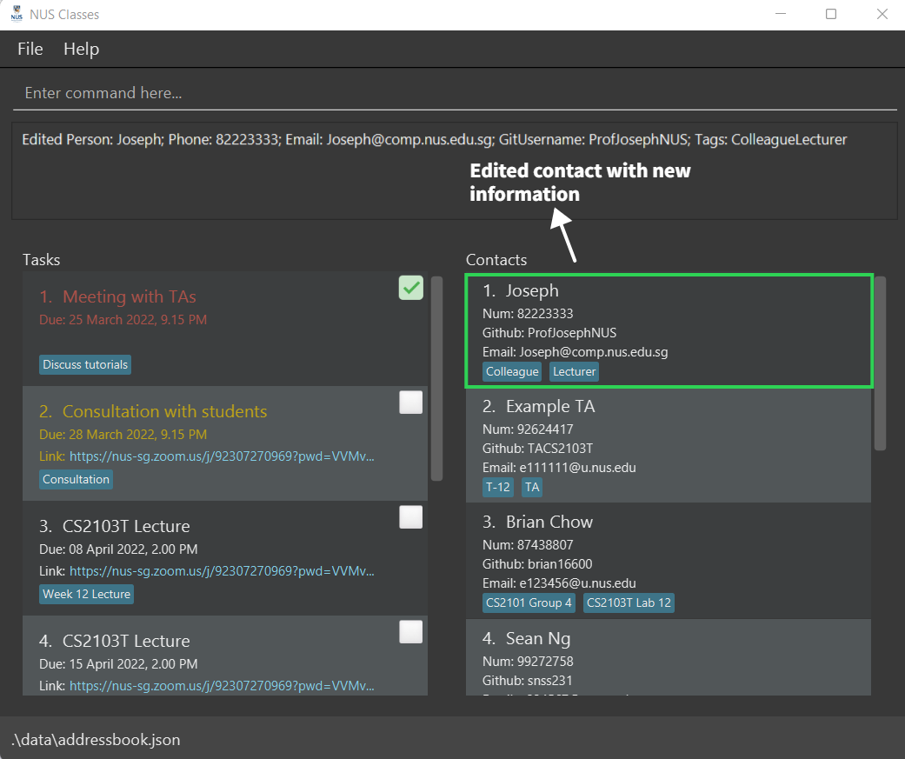
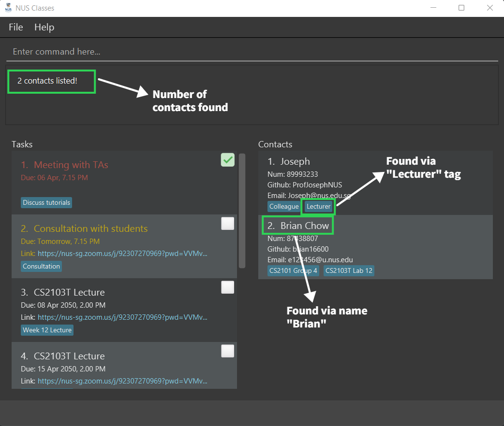
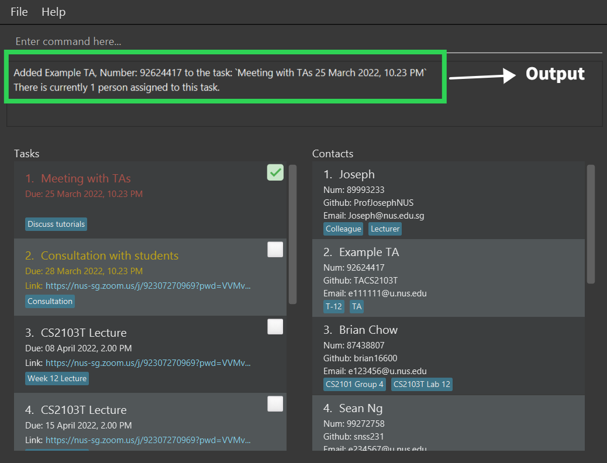
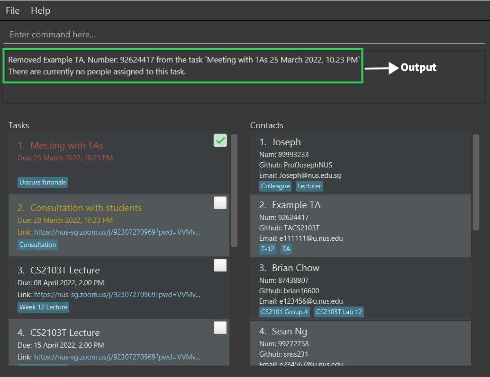

NUS Classes is a desktop app for NUS Computing professors to manage their tasks and contacts. It includes task management features such as 
creating tasks, tagging tasks, assigning contacts to tasks, and marking tasks as complete or incomplete. It also includes contact management features such as finding contacts, assigning contacts to specific tasks and tagging contacts. 

NUS Classes also provides a simple alert feature for tasks by displaying tasks in different color based on the urgency of the task. Tasks that are overdue are marked as red, whereas, tasks that are nearing deadline are marked as yellow.

NUS Classes is optimized for use via a Command Line Interface (CLI) while still having the benefits of a Graphical User Interface (GUI). 
Using NUS Classes can get your contact management tasks done faster than traditional GUI apps, saving time on otherwise tedious administrative tasks.

This User Guide has been conveniently catergorised into **Contact Features**, **Task Features** and **Other Features**. This will help you locate quickly the command that you want to know more about.

Blue text boxes are additional tips and notes to enhance your experience with NUSClasses, while yellow text boxes are warnings that will cause NUSClasses to not function as intended. Graphics are also available to further aid us visually.

Hope you'll be satisfied using NUSClasses :smile:

## Table of Contents

* [Quick Start](#quick-start)
* [Features](#features)
    * [Help](#viewing-help--help)
    * [Contact Features](#contact-features)
        * [Adding a contact](#adding-a-contact-addc)
        * [Listing all contacts](#listing-all-contacts--listc)
        * [Editing a contact](#editing-a-contact--editc)
        * [Finding contacts](#finding-contacts-findc)
        * [Deleting a contact](#deleting-a-contact--deletec)
    * [Task Features](#task-features)
        * [Adding a task](#adding-a-task-addt)
        * [Listing tasks](#listing-tasks--listt)
        * [Editing a task](#editing-a-task-editt)
        * [Finding tasks](#finding-tasks-findt)
        * [Finding tasks by date](#finding-tasks-by-date-findt)
        * [Assigning a contact to a task](#assigning-a-contact-to-a-task-assign)
        * [Viewing contacts assigned to a task](#viewing-contacts-assigned-to-a-task-view)
        * [Unassigning a contact from a task](#unassigning-a-contact-from-a-task-unassign)
        * [Mark a task as done](#marking-a-task-as-done-mark)
        * [Unmark a task as not done](#unmarking-a-task-as-not-done-unmark)
        * [Deleting tasks](#deleting-a-task-deletet)
        * [Generating emails of all contacts assigned to a task](#generating-the-emails-of-all-the-contacts-assigned-to-a-task-gen)
    * [Other Features](#other-features)
        * [Importing contacts from a data file](#importing-contacts-from-a-data-file--import)
        * [Clearing all data](#clearing-all-data--clear)
        * [Exiting the program](#exiting-the-program--exit)
        * [Saving the data](#saving-the-data)
        * [Editing the data file](#editing-the-data-file)
* [FAQ](#faq)
* [Command Summary](#command-summary)

--------------------------------------------------------------------------------------------------------------------

## Quick start

1. Ensure you have Java `11` or above installed in your Computer.

1. Download the latest `NUSClasses.jar` from [here](https://github.com/AY2122S2-CS2103T-T12-4/tp/releases).

1. Copy the file to the folder you want to use as the _main folder_ for your NUS Classes manager.

1. Double-click the file to start the app. The GUI similar to below should appear in a few seconds. Note how the app contains some sample data. 
   

1. Type the command in the command box and press `Enter` to execute it. e.g. typing **`help`** and pressing `Enter` will open the help window. 
   Some example commands you can try:

    * **`listc`** : Lists all contacts.

    * **`addc`**`n/John Doe p/98765432 e/johnd@u.nus.edu u/john123 t/Schoolmate` : Adds a contact named `John Doe` to NUS Classes,
   with email `johnd@u.nus.edu`, Github Username `john123` and tag `Schoolmate`

    * **`deletec`**`3` : Deletes the 3rd contact shown in the current contact list.

   * **`assign`**`1 p/ 2` : Assigns the contact at index 2 to the task at index 1.

   * **`clear`** : Clears all contacts and tasks from NUS Classes

   * **`exit`** : Exits the app.

1. Refer to the [Features](#features) below for details of each command.

--------------------------------------------------------------------------------------------------------------------

# Features

**:information_source: Notes about the command format:** 

* Words in `UPPER_CASE` are the parameters to be supplied by you. 
  e.g. in `addc n/CONTACTNAME`, `CONTACTNAME` is a parameter which can be used as `add n/John Doe`.

* Items in square brackets are optional. 
  e.g. `addc n/CONTACTNAME p/PHONENUMBER e/EMAIL u/GIT_USERNAME [t/TAG]…​` can be used as `n/John Doe t/friend` or as `n/John Doe`.

* Items with `…`​ after them can be used multiple times including zero times. 
  e.g. `[t/TAG]…​` can be used as ` ` (i.e. 0 times), `t/friend`, `t/friend t/family` etc.

* Parameters can be in any order. 
  e.g. if the command specifies `n/NAME p/PHONE_NUMBER`, `p/PHONE_NUMBER n/NAME` is also acceptable.

* If a parameter is expected only once in the command but you specified it multiple times, only the last occurrence of the parameter will be taken. 
  e.g. if you specify `p/12341234 p/56785678`, only `p/56785678` will be taken.

* Extraneous parameters for commands that do not take in parameters (such as `help`, `listc`, `exit` and `clear`) will be ignored. 
  e.g. if the command specifies `help 123`, it will be interpreted as `help`.

* `INDEX` refers to a single non-zero positive integer only, and within the bounds of the number of contacts/number of tasks. Values such as `-1`, `abc`, or `2 abcdefg` are invalid.

### Viewing help : `help`

Shows a message with the link to the User Guide for reference.

**Format**: `help`

## Contact Features

### Adding a contact: `addc`

Adds a contact with basic details like name, phone number, email and Github Username. Tags are optional but can be added as well for easier contact management.

**Format**: `addc n/CONTACTNAME p/PHONENUMBER e/EMAIL u/GITHUB_USERNAME [t/TAG]…​`

**Examples**:

* `addc n/john p/12345678 e/john@nus.edu.sg u/john123 t/Schoolmate`
* `addc n/mary p/87654321 e/mary@gmail.com u/maryCS t/Teammate t/Classmate`

:bulb: **Notes:**

* Contacts with the same names are allowed. Some modules may be big, so there may be students with the same name!

* You can add multiple tags to a contact for easier management, as some students/TAs might be taking your other modules too. Just put t/ before every tag!

* Make sure the contact's email is in the correct format, i.e. abd@gmail.com :white_check_mark:, abd@yahoo :x:

* Make sure the contact's phone number is at least 3 digits long! Phone numbers with > 8 digits are allowed since international phone numbers have different numbers of digits.

* Github usernames can only consist of alphanumeric characters or single hyphens, and cannot begin or end with a hyphen. Usernames such as `john123` and `jo-hn123` are valid, but usernames such as `john123-`, `-john123` and `jo--hn123` are invalid.

### Listing all contacts : `listc`

Shows a list of all contacts in NUS Classes.

**Format**: `listc`

:bulb: **Tip:**
You will find this command useful after using [`findc`](#finding-contacts-by-name-findc)

### Editing a contact : `editc`

Edits an existing contact in NUS Classes.

**Format**: `editc INDEX [n/NAME] [p/PHONE] [e/EMAIL] [u/GITHUB_USERNAME] [t/TAG]…​`

* Edits the contact at the specified `INDEX`.
* The index refers to the index number shown in the displayed contact list.
* At least one of the optional fields must be provided.

:exclamation: **Caution:**
* The index **must be a positive integer** 1, 2, 3, …​

* When editing tags, the existing tags of the contact will be removed i.e. adding of tags is not cumulative.

**Examples**:
* `editc 2 n/Betsy Crower t/` Edits the name of the 2nd contact to be `Betsy Crower` and clears all existing tags.
* `editc 1 p/82223333 e/Joseph@comp.nus.edu.sg` Edits the phone number and email address of the 1st contact to be `82223333` and `Joseph@comp.nus.edu.sg` respectively.
      
    

:bulb: **Tip:**
You can remove all the contact’s tags by typing `t/` without specifying any tags after it. Useful when removing outdated tags from a contact.

### Finding contacts: `findc`

Find contacts whose names and/or tags contain any of the given keywords.

**Format**: `findc KEYWORD [MORE_KEYWORDS]...`

* `KEYWORD` can be used to search for matching words in both tags and names of contacts.
* The search is case-insensitive. e.g `john` will match `John`
* The order of the keywords does not matter. e.g. `Hans Bo` will match `Bo Hans`
* Only full words will be matched e.g. `Han` will not match `Hans`
* Persons matching at least one keyword will be returned (i.e. `OR` search).
  e.g. `hans mary` will return `Hans Bo`, `Mary Sue`

**Examples**:
* `findc John` returns `john` and `John Doe`.
* `findc brian lecturer` returns `Brian Chow`, `Joseph` who has a tag of `Lecturer`. 
     
    

### Deleting a contact : `deletec`

Deletes the specified contact from NUS Classes.

**Format**: `deletec INDEX`

* Deletes the contact at the specified `INDEX`.
* The index refers to the index number shown in the displayed contact list.

:exclamation: **Caution:**
The index **must be a positive integer** 1, 2, 3, …​

**Examples**:
* `listc` followed by `deletec 2` deletes the 2nd contact in NUS Classes.
* `findc Joseph` followed by `deletec 1` deletes the 1st contact in the results of the `findc` command. 
     
       
    

## Task Features

### Adding a task: `addt`

Adds a task for a datetime with a tag.

**Format**: `addt tn/TASKNAME dt/DATETIME [ENDDATETIME] [t/TAG]…​ [z/LINK] [r/INTERVAL RECURRENCE]`

* The format for TIME is in `dd-MM-yyyy HHmm`.

:exclamation: **Caution:**
The task that you are creating cannot have duplicate tags, tags are unique for that specific task e.g. `addt tn/Lecture dt/12-12-2022 1200 t/Weekly Lecture t/Weekly Lecture` would be invalid.

:bulb: **Notes about `TASK`:** 
* Two Tasks with the same `TASKNAME` is valid. This is to allow for multiple tasks with different dates to be valid, such as `CS2103T Lecture`
at `04/04/2022` and another `CS2103T Lecture` at `11/04/2022`.

* You can create overdue Tasks (with `DATETIME` before today) if you wish to remind yourself of overdue tasks! :smiley:

:bulb: **Notes about `INTERVAL RECURRENCE`:** 

* `INTERVAL` refers to the number of days for next occurrence of the task:  
_e.g. `INTERVAL` = 5 (days) for a task on 01-01-2022 would next occur on 05-01-2022._
* For `INTERVAL`, the values `daily`,`weekly`,`monthly`, `quarterly` and `annually` are accepted.
* `RECURRENCE` refers to how many cycles the task is to be repeated: 
_e.g. `RECURRENCE` = 5 (cycles) with an `INTERVAL` = 7 (equivalent to `weekly`) means that the task repeats weekly for 5 cycles._

**Examples**:
* `addt tn/Meeting dt/17-03-2022 1800 t/School` Adds a task called Meeting for `17th March 2022, 6pm` at School.
* `addt tn/Consultation dt/19-03-2022 1500, 19-03-2022 1600` Adds a task called Consultation taking place from `19th March 2022 3-4pm`.
* `addt tn/CS2103 Lecture dt/19-03-2022 1500, 19-03-2022 1600 z/https://nus-sg.zoom.us…​ r/weekly 12`
Adds a task called CS2103 Lecture taking place from `19th March 2022 3-4pm` that occurs `weekly` for `12 cycles` with the `meeting link`.
* `addt tn/Running dt/12-02-2022 1900 t/Track r/3 5` Adds a task called Running for `12th February 2022, 7pm` that occurs `every 3 days` for `5 cycles`.

### Editing a task: `editt`
Edits an existing task in the task list.

**Format**: `editt INDEX [tn/TASKNAME] [dt/DATETIME, ENDDATETIME*] [z/LINK] [t/TAG]…​`

* Edits the task at the specified `INDEX`. The index refers to the index number shown in the displayed task list.
* At least one of the optional fields must be provided.
* Existing values will be updated to the input values.

:exclamation: **Caution:**
The index **must be a positive integer** 1, 2, 3, …​

**Examples**:
* `editt 1 tn/Meeting with TAs` Edits the name of the 1st displayed task to be `Meeting with TAs`.
* `editt 2 tn/Meeting with Prof Tan dt/01-12-2022 1200, 01-12-2022 1300` Edits the name of the 2nd displayed task to be `Meeting with Profs Tan` and the date to be `01 Dec 2022, 12pm-1pm`.  
     
    

* `editt 1 dt/12-12-2022 1200, 12-12-2022 1400` Edits the datetime of the 1st displayed task to be on `12 Dec 2022, 12-2pm`.  
     
    
    

:bulb: **Tips:**  

* If there's no need to change a certain field you can leave it out! 
* The `ENDDATETIME` field is optional.

### Finding tasks: `findt`

Find tasks whose task names or tags contain any of the given keywords.

**Format**: `findt KEYWORD [MORE_KEYWORDS]...[TAG]...`
* `KEYWORD` can be used to search for matching words in both tags and names of tasks.
* The search is case-insensitive. e.g `lecture` will match `Lecture`
* The order of the keywords does not matter. e.g. `Lecture CS2103T` will match `CS2103T Lecture`
* Only full words will be matched e.g. `Tut` will not match `Tutorial`
* Tasks matching at least one keyword will be returned (i.e. `OR` search).
  e.g. `Lecture Tutorial` will return `CS2103T Lecture`, `Tutorial 12`

**Examples**:
* `findt with` returns `Consultation with students` and `Meeting with invigilators`.
* `findt week` returns all recurring instances of `CS2103T Lecture` as their tags contain `Week XX Lecture`.
* `findt TAs lecture` returns `Meeting with TAs` and all recurrences of `CS2103T lecture`.  
     
    

:bulb: **Tip:**
If you have many tasks, using `findt` will help you to keep organized! 

### Finding tasks by date: `findt`
Find tasks whose task falls in between the given dates (inclusive).

**Format**: `findt dt/DATETIME1, DATETIME2`

* The ordering of date doesn't matter . e.g `dt/12-02-2022 0800, 13-03-2022 0800` will match `dt/13-02-2022 0800, 12-03-2022 0800`
* `DATETIME1` and `DATETIME2` follows this format: _dd-MM-yyyy HHmm_
* _dd_: Day; _MM_: Month; _yyyy_: Year; _HH_: Hour; _mm_: Minutes
* `HHmm` is in 24-Hour format
* Requires 2 date time inputs

**Examples**:
* `findt dt/14-04-2022 0900, 15-04-2022 0900` Finds all tasks in between `14th April 2022, 9am` and `15th April 2022, 9am`, inclusive.
* `findt dt/15-02-2022, 13-02-2022` Finds all tasks in between `13th February 2022, 12mn` and `15th February 2022, 11:59pm`, inclusive.
* `findt dt/20-12-2022, 21-12-2022 0900` Finds all tasks in between `20th December 2022 12mn` and `21st December 2022 9am`, inclusive.

:bulb: **Tip:**
`DATETIME1` and `DATETIME2` do not require `HHmm` if you wish to find tasks that fall on/in between the dates.

### Assigning a contact to a task: `assign`
Assigns a contact in the contact list to a task.

**Format**: `assign INDEX p/CONTACTINDEX`

* Assigns the contact at the specified `CONTACTINDEX` to the task at `INDEX`. 
* The indices refer to the index numbers shown in the corresponding displayed task/contact list.

:exclamation: **Caution:**
The index **must be a positive integer** 1, 2, 3, …​

**Examples**:
* `assign 1 p/2` Assigns the 2nd contact in the contact list to the 1st task in the task list.  
     
    

### Viewing contacts assigned to a task: `view`

Display all contacts assigned to a given task.

**Format**: `view TASKINDEX`

* View all the contact assigned to the task located the specified `INDEX`
* The index refers to the index number shown in the displayed task list.

:exclamation: **Caution:**
The index **must be a positive integer** 1, 2, 3, …​

**Examples**:
* `view 2` will display all contacts assigned to the 1st task in the task list.  
   
  

  
### Unassigning a contact from a task: `unassign`
Unassigns a contact in the contact list from a task.

**Format**: `unassign INDEX p/CONTACTINDEX`

* Unassigns the contact at the specified `CONTACTINDEX` to the task at `INDEX`. 
* The indices refer to the index numbers shown in the corresponding displayed task/contact list.
* The `view` command can help you quickly identify which contacts are already assigned to a task.

:exclamation: **Caution:** 
* The index **must be a positive integer** 1, 2, 3, …​
* If the contact is not already assigned to the task, the operation will fail.

**Examples**:
* `unassign 1 p/2` Unassigns the 2nd contact in the contact list from the 1st task in the task list. 
     
    

### Marking a task as done: `mark`

Marks the specified task from the task list as done.

**Format**: `mark INDEX`

* Marks the task at the specified `INDEX`.
* The index refers to the index number shown in the displayed task list.
* Icon will display a green tick to show the task is marked.

:exclamation: **Caution:**
The index **must be a positive integer** 1, 2, 3, …​

**Examples**:
* `mark 2` marks the task at index 2 as done.  
     
    

### Unmarking a task as not done: `unmark`

Unmarks the specified task from the task list as not done.

**Format**: `unmark INDEX`

* Unmarks the task at the specified `INDEX`.
* The index refers to the index number shown in the displayed task list.
* Icon will display an empty white box to show the task is unmarked.

:exclamation: **Caution:**
The index **must be a positive integer** 1, 2, 3, …​

**Examples**:
* `unmark 2` unmarks the task at index 2 as not done.  
     
    

### Listing tasks : `listt`

Shows a list of all the tasks in the task list as per the specified filtering options. `listt` has the three following formats:

**Format**:

`listt all/`
Shows a list of all tasks in the task list.

`listt c/`
Shows a list of tasks that is marked as completed in the task list.

`listt nc/`
Shows a list of tasks that is not mark as completed in the task list.

**:information_source: Information:**
<ul>
    <li>If more than 1 prefixes is present, system will prioritise `all/` -> `nc/` -> `c/` .</li>
</ul>

### Deleting a task: `deletet`

Deletes the specified task from the task list.

**Format**: `deletet INDEX`

* Deletes the task at the specified `INDEX`.
* The index refers to the index number shown in the displayed task list.

:exclamation: **Caution:**
The index **must be a positive integer** 1, 2, 3, …​

**Examples**:
* `listt all/` followed by `deletet 1` lists out all the tasks in NUS Classes, then deletes the task at index 1.
* `findt lecture` followed by `deletet 2` lists out all tasks with the keyword `lecture`, then deletes the task at index 2.  
      Finding the tasks by keyword `lecture`:
    
     
      Deleting the lecture at index 2 `deletet 2`:
    

### Generating the emails of all the contacts assigned to a task: `gen`

Displays all the emails of all the contacts assigned to the specified task and displays a button to copy the emails into your clipboard.

**Format**: `gen INDEX`

* Displays all the emails of the contacts assigned to the task at the specified `INDEX`.
* The index refers to the index number shown in the displayed task list.

:exclamation: **Caution:**
The index **must be a positive integer** 1, 2, 3, …​

**Examples**:
* `gen 1` displays all the emails of the contacts assigned to the task at index 1.  
   
  

# Other Features

### Clearing all data : `clear`

Clears all contacts and tasks from NUS Classes.

**Format**: `clear`

:exclamation: **Caution:**
Be careful! This action is irreversible.

### Exiting the program : `exit`

Exits the program.

**Format**: `exit`

### Saving the data

NUS Classes data are saved in the hard disk automatically after any command that changes the data. There is no need to save manually.

### Editing the data file

NUS Classes data are saved into two JSON files:
* `[JAR file location]/data/addressbook.json` for contact data
* `[JAR file location]/data/tasklist.json` for task data

Advanced users are welcome to update data directly by editing these data files.

:exclamation: **Caution:**
If your changes to the data file makes its format invalid, NUS Classes will discard all data and start with an empty data file at the next run.

### Importing contacts from a data file : `import`

Imports a list of contacts from a .csv file.

**Format**: `import fp/FILEPATH`

* The .csv file must contain the following 5 headers (Name, Phone, Email, Github, Tags). Any other headers will be ignored.
* If there are repeated headers, the first one will be considered.
* Tags in the .csv file should be separated with a `/` character.
* Invalid csv entries (e.g. due to invalid or duplicate fields) will be skipped, but valid entries will still be added.

**Examples**:
* `import fp/data/data.csv` (macOS/Linux) / `import fp/data\data.csv` (Windows)  will import all valid entries from the `data.csv` folder in the `/data` directory of the NUS Classes folder.
* `import fp/contacts.csv` (all supported platforms) will import all valid entries from the `contacts.csv file` in the NUS Classes root folder.
    
  
    
  

### User-friendly date display

Instead of always displaying dates in full (e.g. DD MM YYYY), our dates will be displayed based on the current day to be more user-friendly. Here's a reference if you get confused:

| Displayed date                  | Explanation                                                                                                                                                                                                               |
|---------------------------------|---------------------------------------------------------------------------------------------------------------------------------------------------------------------------------------------------------------------------|
| `Today`                         | The current calendar day.                                                                                                                                                                                                 |
| `Tomorrow`                      | The next calendar day.                                                                                                                                                                                                    |
| Day of week (e.g. `Mon`, `Sat`) | The next occurrence of that day of week. Examples: - If today is `7 Apr, Thu`, `Tue` will refer to the _next_ Tuesday `12 Apr, Tue` - If today is `4 Apr, Mon`, `Mon` will refer to the _next_ Monday `11 Apr, Mon` |
| Day and month (without year)    | The day of the current calendar year (e.g. if the current calendar year is 2022, `11 Apr` refers to `11 Apr 2022`                                                                                                         |
| Day, month and year             | -                                                                                                                                                                                                                         |

--------------------------------------------------------------------------------------------------------------------

## FAQ

**Q**: How do I transfer my data to another Computer? 
**A**: Install the app in the other computer and overwrite the empty data file it creates with the file that contains the data of your previous NUS Classes home folder.

**Q**: Do I need to have extensive knowledge about Command Line Interface (CLI) to use this?  
**A**: Nope! Simply refer to the format given in our [Command Summary](#command-summary) and our [Features Section](#features) for guidance!

**Q**: I have further questions about NUS Classes. Where do I ask?  
**A**: Open an Issue in our team's [Issue Tracker](https://github.com/AY2122S2-CS2103T-T12-4/tp/issues) and we'll look into it! :smiley:

**Q**: Who do I contact if I want to be part of the Developer team? 
**A**: You can email us at _e0544441@u.nus.edu_ with the subject `Interest in joining NUSClasses Developer Team`

**Q**: What do I do to update the app? 
**A**: Uninstall the current version of the app. Then, download the latest version of `NUSClasses.jar` from our [GitHub releases](https://github.com/AY2122S2-CS2103T-T12-4/tp/releases)

--------------------------------------------------------------------------------------------------------------------

## Command summary

| Action                                                                                                                             | Format                                                                                   |
|------------------------------------------------------------------------------------------------------------------------------------|------------------------------------------------------------------------------------------|
| [**Add Contact**](#adding-a-contact-addc)                                                                                          | `addc n/NAME p/PHONE_NUMBER e/EMAIL u/GIT_USERNAME [t/TAG]…​`                            |
| [**List Contacts**](#listing-all-contacts--listc)                                                                                  | `listc`                                                                                  |
| [**Edit Contact**](#editing-a-contact--editc)                                                                                      | `editc INDEX [n/NAME] [p/PHONE_NUMBER] [e/EMAIL] [u/GITHUBUSERID] [t/TAG]…​`             |
 | [**Find Contacts**](#finding-contacts-findc)                                                                                       | `findc KEYWORD [MORE_KEYWORDS]…​`                                                        |
| [**Delete**](#deleting-a-contact--deletec)                                                                                         | `deletec INDEX`                                                                          |
| [**Add Task**](#adding-a-task-addt)                                                                                                | `addt tn/TASKNAME dt/DATETIME[, ENDDATETIME] [t/TAG]…​ [z/LINK] [r/INTERVAL RECURRENCE]` |
| [**List Tasks**](#listing-tasks--listt)                                                                                            | `listt all\` or `listt nc/` or `listt c/`                                                |
| [**Edit Task**](#editing-a-task-editt)                                                                                             | `editt INDEX [tn/TASKNAME] [dt/DATETIME, ENDDATETIME*] [z/LINK] [t/TAG]`                 |
| [**Find Task**](#finding-tasks-findt)                                                                                              | `findt KEYWORD [MORE_KEYWORDS]…​`                                                        |
| [**Find Task by Date**](#finding-tasks-by-date-findt)                                                                              | `findt dt/DATETIME1, DATETIME2`                                                          |
| [**Assign contact   To Task**](#assigning-a-contact-to-a-task-assign)                                                           | `assign INDEX p/CONTACTINDEX`                                                            |
| [**View contacts Assigned to Task**](#viewing-contacts-assigned-to-a-task-view)                                                 | `view INDEX`                                                                             |
| [**Unassign contact  From Task**](#unassigning-a-contact-from-a-task-unassign)                                                  | `unassign INDEX p/CONTACTINDEX`                                                          |
| [**Mark Task**](#marking-a-task-as-done-mark)                                                                                      | `mark INDEX`                                                                             |
| [**Unmark Task**](#unmarking-a-task-as-not-done-unmark)                                                                            | `unmark INDEX`                                                                           |
| [**Delete Task**](#deleting-a-task-deletet)                                                                                        | `deletet INDEX`                                                                          |
| [**Generating emails of all the contacts Assigned to task**](#generating-the-emails-of-all-the-contacts-assigned-to-a-task-gen) | `gen INDEX`                                                                              |
| [**Clear all data**](#clearing-all-data--clear)                                                                                    | `clear`                                                                                  |
| [**Import contacts**](#importing-contacts-from-a-data-file--import)                                                                | `import fp/FILEPATH`                                                                     |
| [**Exit**](#exiting-the-program--exit)                                                                                             | `exit`                                                                                   |

